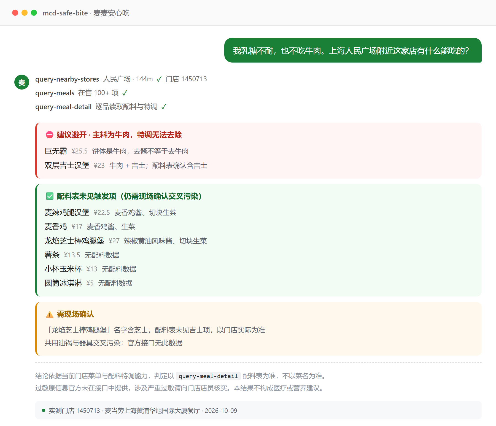

<div align="center">

# 麦麦安心吃 · mcd-safe-bite

**「吉士」写在名字里的 burger，配料表里可能根本没有吉士。**

基于麦当劳 MCP 的饮食限制翻译官 — 把你的忌口，变成这家门店现在真能点出来的方案

[](https://github.com/M-China/mcd-mcp-server)
[](https://github.com/M-China/mcd-developer-innovation-challenge)

[快速开始](#快速开始) · [它解决什么](#它解决什么) · [能力边界](#能力边界诚实地说) · [工作原理](#工作原理)

</div>

---

## 它解决什么

你在菜单上看到「巨无霸」，想知道能不能去掉吉士。
菜单不会告诉你配料。**配料在菜单上是不可见的。**

这个 Skill 调麦当劳 MCP 把配料拆到**可增减的粒度**，然后直接给结论：
**能吃 / 怎么改能吃 / 别吃了。**

### 真实运行结果

用户输入：**「我乳糖不耐，也不吃牛肉」**（门店 1450713，数据 2026-10-09 实测）

```
⛔ 建议避开 · 主料为牛肉，特调无法去除
  · 巨无霸 ¥25.5          饼体是牛肉，去酱不等于去牛肉
  · 双层吉士汉堡 ¥23      牛肉 + 吉士

✅ 配料表未见触发项（仍需现场确认交叉污染）
  · 麦辣鸡腿汉堡 ¥22.5    配料：麦香鸡酱、切块生菜
  · 麦香鸡 ¥17           配料：麦香鸡酱、生菜
  · 龙焰芝士棒鸡腿堡 ¥27   配料：辣椒黄油风味酱、切块生菜
  · 薯条 ¥13.5 · 小杯玉米杯 ¥13 · 苹果片 ¥7
  · 圆筒冰淇淋 ¥5         无配料数据

⚠️ 需现场确认
  · 「龙焰芝士棒鸡腿堡」名字含芝士，配料表未见吉士项，以门店实际为准
  · 共用油锅与器具交叉污染：官方接口无此数据

结论依据当前门店菜单与配料特调能力。
过敏原信息官方未在接口中提供，涉及严重过敏请向门店店员核实。
```

**注意第三行**：龙焰芝士棒鸡腿堡名字里有「芝士」，配料表里却没有吉士。
按菜名过滤会把它误判成不能吃，按配料过滤才是对的 ——
这也是本项目坚持只用 `query-meal-detail` 数据的原因。

<p align="center">
  
</p>

<p align="center"><sub>真实运行截图 · 门店 1450713 · 2026-10-09 · 每一行结论都可回溯到 MCP 返回字段</sub></p>

> 复现方式：接入 MCP 后输入「我乳糖不耐，也不吃牛肉」并给出城市与位置即可。
> 若你所在门店出现菜名与配料不一致的情况，欢迎提 Issue ——
> 那正是本项目最想被挑战的地方。

---

## 能力边界（诚实地说）

很多同类项目会说自己能「查过敏原」。**麦当劳 MCP 的营养接口做不到这件事。**

`list-nutrition-foods` 实际返回的字段只有这些：

```
energyKj, energyKcal, protein, fat, carbohydrate, sodium, calcium
```

**没有**过敏原、**没有**配料表、**没有**素食标识、**没有**清真认证。

所以这个项目把话说清楚：

| 你问的 | 本项目 |
|---|---|
| 配料能不能去掉（吉士、洋葱粒、酱料） | ✅ 依据 `query-meal-detail` 实测配料表 |
| 能量 / 钠 / 蛋白含量 | ✅ 依据营养库实测值 |
| 是否含花生、坚果、麸质、芝麻、贝类 | ⚠️ 接口无数据，需现场确认 |
| 是否清真认证 / 是否素食 | ⚠️ 接口无数据，需现场确认 |
| 交叉污染（共用油锅） | ⚠️ 接口无数据 |

**涉及严重过敏史或曾出现过敏性休克，请不要依赖本项目结论下单，直接联系门店确认。**

这是能力边界，不是免责声明。把结论限定在数据支撑得住的范围内，
用户才敢照着点。

---

## 快速开始

### 前置

在 [open.mcd.cn/mcp](https://open.mcd.cn/mcp) 申请麦当劳 MCP Token。

### 1. 配置连接器

WorkBuddy / Cherry Studio / Cursor / Trae 等支持 Streamable HTTP 的客户端均可。

```json
{
  "mcpServers": {
    "mcd-mcp": {
      "type": "streamablehttp",
      "url": "https://mcp.mcd.cn",
      "headers": {
        "Authorization": "Bearer YOUR_MCP_TOKEN"
      }
    }
  }
}
```

仓库内 [`mcp-config.example.json`](mcp-config.example.json) 使用 `${MCD_MCP_TOKEN}`
环境变量占位符，不含任何真实凭证。

### 2. 安装 Skill

```
mcd-safe-bite/
├── SKILL.md
└── references/
    ├── constraint-db.md    # 限制类型 → 配料 → 判定规则
    └── mcd-tools.md        # 字段速查 + 10 个数据陷阱
```

放入你的 Skill 目录后即可对话使用。

### 3. 直接问

```
我乳糖不耐，也不吃牛肉，附近门店有什么能吃的？
体检说让我控钠，这里最合适的是什么？
巨无霸能改哪些？改完多少钱？
```

---

## 工作原理

```
① query-nearby-stores   定位门店 → storeCode
② query-meals          拉该店真实在售菜单与价格
③ query-meal-detail    拉配料与特调能力   ← 核心
④ list-nutrition-foods 补能量 / 钠 / 蛋白
⑤ calculate-price      算改动后价格（用户确认后）
```

整个项目的地基是第 ③ 步。它把配料拆到可增减粒度，并给出保留 / 去除的 key：

```json
{ "name": "巨无霸", "supportModify": true,
  "modification": { "items": [{ "values": [
    { "name": "吉士",   "selectedKey": "0-1", "unselectedKey": "0-0" },
    { "name": "酸黄瓜", "selectedKey": "0-1", "unselectedKey": "0-0" }
  ]}]}}
```

去掉吉士，就是把 key 换成 `"0-0"` 传给算价与下单接口。

**只有出现在这个列表里的配料，本项目才会讨论它能不能去掉。**
没出现的，就是它无法确认的。

⚠️ 套餐要逐轮次读：巨无霸三件套顶层 `supportModify=false`，
但轮次内汉堡 `true`、饮料 `true` —— 汉堡能去吉士、饮料能换无糖可乐。
只看顶层会漏掉真正可调的部分。

细节见 [`MCP_INTEGRATION.md`](MCP_INTEGRATION.md)。

---

## 目标用户

- **过敏人群** — 需要「删掉哪几样」，而不是「这道能不能吃」
- **宗教饮食** — 明确改动可行性，并得到认证需现场确认的提示
- **控钠 / 控热量人群** — 从菜单里快速筛出可行项
- **门店与客服** — 特调能力整理成结构化说明，降低沟通成本

---

## 项目结构

| 文件 | 说明 |
|---|---|
| `SKILL.md` | Skill 主文件，七步流程与六条铁律 |
| `references/constraint-db.md` | 限制类型 → 配料关键词 → 判定规则 |
| `references/mcd-tools.md` | 字段速查、10 个实测数据陷阱 |
| `MCP_INTEGRATION.md` | 工具清单、调用流程、特调传参规则 |
| `CONTEST_DECLARATION.md` | 参赛声明（官方原文，未改动） |
| `mcp-config.example.json` | 脱敏配置，仅环境变量占位符 |
| `workbuddy.md` | WorkBuddy 开发上下文 |

---

## 实测状态

**已验证**（门店 1450713，2026-10-09）：
`query-nearby-stores` · `query-meals` · `query-meal-detail` · `list-nutrition-foods`

README 与 `references/` 中的配料结论均来自上述实测返回，逐项可追溯。

**待验证**：`calculate-price` 在当前工具调用层报 `items` 数组解析失败
（含最简合法入参同样失败），判断为客户端序列化问题、非接口变更。
详见 [`references/mcd-tools.md`](references/mcd-tools.md) 第 10 条。

---

## 声明

本项目为**麦当劳程序员创意开发大赛**参赛作品，由参赛者独立开发，
非麦当劳官方产品，与麦当劳公司无隶属或背书关系。

项目输出仅供参考，不构成医疗、营养或其他专业建议。
餐品信息、价格及供应状态以麦当劳官方渠道的实时结果为准。

---

<div align="center">

**如果你有过点麦当劳被配料坑到的经历，这个项目就是为你做的。**

如果它帮到了你，欢迎 Star — 每一颗都是下一位忌口用户被帮到的机会。

</div>
