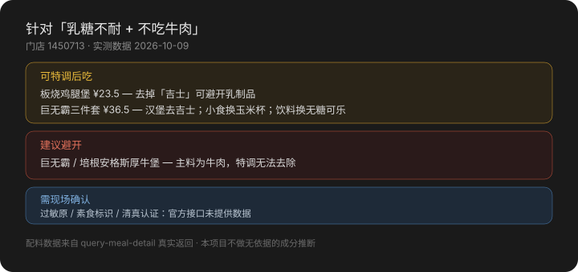

<div align="center">

# 麦麦安心吃 · mcd-safe-bite

**你的饮食限制，在这家门店到底能不能点。**

麦当劳忌口可行性翻译官 · 基于麦当劳 MCP

[](https://github.com/M-China/mcd-mcp-server)
[](LICENSE)

</div>

---

## 它解决什么

你在菜单上看到「巨无霸」。你不知道它含不含吉士、能不能去掉吉士、去掉之后还多少钱。

**配料在菜单上是不可见的。**

这个 Skill 把麦当劳 MCP 的菜单与特调能力翻成一份清单，直接告诉你：
**能吃、怎么改能吃、还是别吃了。**

<p align="center">
  
</p>

上例为真实门店数据（上海黄浦华旭国际大厦餐厅，2026-10-09）。

---

## 先说清楚它做不到什么

这个项目不猜 ingredients，因为**麦当劳 MCP 的营养接口没有过敏原字段**。

`list-nutrition-foods` 只返回：

```
energyKcal, protein, fat, carbohydrate, sodium, calcium
```

**没有**过敏原、**没有**配料表、**没有**素食标识、**没有**清真认证。

所以：

| 问题 | 本项目 |
|---|---|
| 配料能不能去掉（吉士、洋葱粒、酱料） | ✅ 依据 `query-meal-detail` 的真实特调数据 |
| 能量 / 钠 / 蛋白含量 | ✅ 依据营养库实测值 |
| 是否含花生、坚果、麸质、芝麻、贝类 | ⚠️ 接口无数据，需现场确认 |
| 是否清真认证 / 是否素食 | ⚠️ 接口无数据，需现场确认 |
| 交叉污染（共用油锅） | ⚠️ 接口无数据 |

**涉及严重过敏时，请直接联系门店确认，不要依赖本项目的结论下单。**

这不是免责声明，是我们把能力边界画在了数据允许的地方。

---

## 安装

### 前置

需要麦当劳中国的 MCP Token。前往 [open.mcd.cn/mcp](https://open.mcd.cn/mcp) 申请。

### 配置连接器

WorkBuddy / Cherry Studio / Cursor / Trae 等支持 Streamable HTTP 的客户端均可。

```json
{
  "mcpServers": {
    "mcd-mcp": {
      "type": "streamablehttp",
      "url": "https://mcp.mcd.cn",
      "headers": {
        "Authorization": "Bearer YOUR_MCP_TOKEN"
      }
    }
  }
}
```

仓库内的 [`mcp-config.example.json`](mcp-config.example.json) 使用 `${MCD_MCP_TOKEN}`
环境变量占位符，不含任何真实凭证。

### 安装 Skill

将 [`SKILL.md`](SKILL.md) 与 `references/` 目录放入你的 Skill 目录：

```
mcd-safe-bite/
├── SKILL.md
└── references/
    ├── constraint-db.md    # 限制类型 → 配料 → 判定规则
    └── mcd-tools.md        # 工具字段速查与数据边界
```

---

## 使用示例

### 例 1 · 乳糖不耐 + 不吃牛肉

> 我乳糖不耐，也不吃牛肉，上海人民广场附近有什么能吃的？

```
针对「乳糖不耐 + 不吃牛肉」：

⚠️ 可特调后吃
· 麦香鸡 ¥17 — 配料表为「麦香鸡酱 + 生菜」，未见乳制品项
· 板烧鸡腿堡 ¥23.5 — 去掉「吉士」可避开乳制品
· 巨无霸三件套 ¥36.5 — 汉堡去吉士；小食换「玉米杯」；饮料换「无糖可口可乐」

⛔ 建议避开
· 巨无霸、培根安格斯厚牛堡 — 主料为牛肉，特调无法去除
· 吉士汉堡包、双层吉士汉堡 — 吉士为乳制品

以上基于当前门店菜单与配料特调能力。
过敏原信息官方未在接口中提供，涉及严重过敏请向门店店员核实。
```

### 例 2 · 控钠

> 医生让我控钠，这家店什么最合适？

按 `sodium` 升序给出实测推荐：
大杯玉米杯 2mg、浓缩咖啡 3mg、中杯玉米杯 1mg、苹果片 0mg、无糖可口可乐 0mg。
同时提示多数汉堡在 480–1370mg 区间。

### 例 3 · 想看特调能改什么

> 巨无霸能改哪些？

调 `query-meal-detail`，逐项列出配料与保留/去除的 key，
并给出对应的下单传参 JSON。

---

## 工作原理

```
① query-nearby-stores   定位门店 → storeCode
② query-meals          拉该店真实在售菜单
③ query-meal-detail    拉配料与特调能力   ← 核心
④ list-nutrition-foods 补能量 / 钠 / 蛋白
⑤ calculate-price      算改动后价格（用户确认后）
```

整个项目的地基是第 ③ 步。`query-meal-detail` 会把配料拆到可增减的粒度，
并给出保留 / 去除的 key：

```json
{ "name": "巨无霸", "supportModify": true,
  "modification": { "items": [{ "values": [
    { "name": "吉士",   "selectedKey": "0-1", "unselectedKey": "0-0" },
    { "name": "酸黄瓜", "selectedKey": "0-1", "unselectedKey": "0-0" }
  ]}]}}
```

去掉吉士就是把 key 换成 `"0-0"` 传给算价与下单接口。
**只有出现在这个列表里的配料，本项目才会讨论它能不能去掉。**

细节见 [`MCP_INTEGRATION.md`](MCP_INTEGRATION.md)。

---

## 目标用户

- **过敏人群**：需要「删掉哪几样」而不是「这道能不能吃」
- **宗教饮食**：需要明确改动可行性（并会得到认证需现场确认的提示）
- **控钠 / 控热量人群**：需要从菜单里快速筛出可行项
- **门店与客服**：把特调能力整理成结构化说明，降低沟通成本

---

## 项目结构

| 文件 | 说明 |
|---|---|
| `SKILL.md` | Skill 主文件，七步流程与铁律 |
| `references/constraint-db.md` | 限制类型 → 配料关键词 → 判定规则 |
| `references/mcd-tools.md` | MCP 字段速查、9 个数据陷阱 |
| `MCP_INTEGRATION.md` | 工具清单、调用流程、传参规则 |
| `CONTEST_DECLARATION.md` | 参赛声明（官方原文，不可修改） |
| `mcp-config.example.json` | 脱敏配置，仅环境变量占位符 |

---

## 已验证 / 待验证

**已实测通过**（上海门店 1450713，2026-10-09）：
`query-nearby-stores` · `query-meals` · `query-meal-detail` · `list-nutrition-foods`

**待验证**：`calculate-price` 在 WorkBuddy 工具调用层存在数组参数解析问题
（报 `/items: must be array`，含最简合法入参同样失败）。判断为客户端序列化问题，
非接口变更。详见 [`references/mcd-tools.md`](references/mcd-tools.md)。

---

## 声明

本项目为**麦当劳程序员创意开发大赛**参赛作品，由参赛者独立开发，非麦当劳官方产品。

项目输出仅供参考，不构成医疗、营养或其他专业建议。
餐品信息、价格及供应状态以麦当劳官方渠道的实时结果为准。

---

<div align="center">

**如果你有过点麦当劳被配料坑到的经历，这个项目就是为你做的。**

</div>
